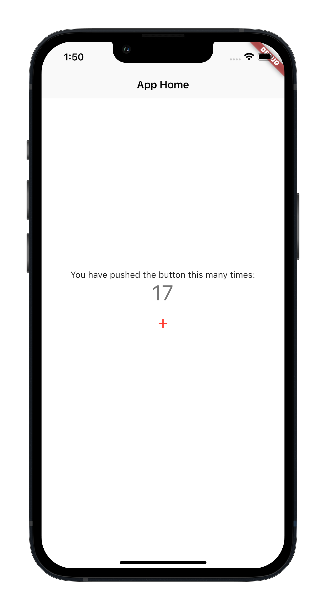

# guess_the_flag

### Overview

This project is a template for building fullstack Dart applications running on Flutter. 
This app is fully deployable to any App Store PaaS (Flutter Web) like Firebase and MS 
Azure App Service that understands how to build and run projects with package.json file. 

## Getting Started

This project is a starting point for a Flutter application.

A few resources to get you started if this is your first Flutter project:

- [Lab: Write your first Flutter app](https://flutter.dev/docs/get-started/codelab)
- [Cookbook: Useful Flutter samples](https://flutter.dev/docs/cookbook)

For help getting started with Flutter, view our
[online documentation](https://flutter.dev/docs), which offers tutorials,
samples, guidance on mobile development, and a full API reference.
